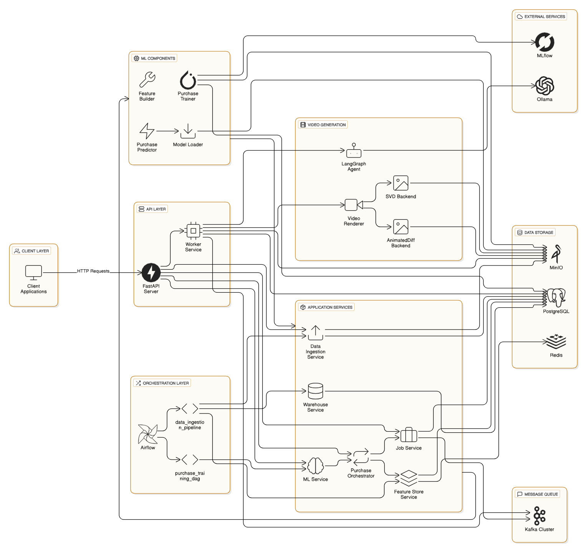

# Stable Ads

## Table of Contents

- [Overview](#overview)
- [Architecture](#architecture)
- [System Components](#system-components)
- [Setup and Installation](#setup-and-installation)
- [Usage](#usage)
- [API Endpoints](#api-endpoints)
- [Folder Structure](#folder-structure)
- [Access Services & Dashboards](#access-services--dashboards)

## Overview

Stable Ads is an end-to-end ML system designed to predict customer purchase probability and then generate personalize video advertisement. The system processes raw event data, engineers features, trains deep learning models, and serves predictions through a REST API. It supports both batch processing for existing customers and real-time feature computation for new customers.

### Key Features

- **Data Ingestion**: Automated CSV file ingestion with validation and transformation
- **Feature Store**: Offline feature materialization and online feature serving via Redis
- **ML Training**: PyTorch-based neural network training with MLflow integration
- **Real-time Inference**: Low-latency predictions for both registered users and anonymous sessions
- **Personalized Video Ad Generation**: AI-powered video ad creation using Stable Video Diffusion (SVD) and LLM-based script generation
- **Orchestration**: Airflow DAGs for automated data pipelines and model training
- **Scalable Infrastructure**: PostgreSQL, MinIO, Kafka, Redis, and Airflow

### Architecture Layers

1. **Data Layer**: PostgreSQL (warehouse), MinIO (object storage), Redis (online features)
2. **Processing Layer**: Airflow (orchestration), Python services (data processing)
3. **ML Layer**: PyTorch (training), Feature Store (offline/online), Model Registry (MinIO)
4. **Serving Layer**: FastAPI (REST API), Real-time feature computation
5. **Video Generation Layer**: LangGraph (script generation), Stable Video Diffusion (video rendering), Kafka (job queue)

## Architecture


### End-to-End Flow: From Data to Video Ads

```mermaid
flowchart TB
    subgraph "Data Pipeline"
        A[CSV File Upload] --> B[Data Ingestion API]
        B --> C[MinIO: Store Raw File]
        C --> D[Airflow: Process Ingestion]
        D --> E[Warehouse: Store Events]
        E --> F[Feature Store: Compute Features]
        F --> G[Redis: Cache Online Features]
    end
    
    subgraph "ML Pipeline"
        H[Airflow: Training DAG] --> I[Load Features]
        I --> J[Train PyTorch Model]
        J --> K[Save Model to MinIO]
        K --> L[Register Production Model]
    end
    
    subgraph "Prediction & Ad Generation"
        M[API: Prediction Request] --> N[Get User Features]
        N --> O[ML Model: Predict Purchase]
        O --> P{Will Purchase?<br/>Probability >= Threshold}
        P -->|No| Q[Return Prediction Only]
        P -->|Yes| R[PurchaseOrchestrator]
        R --> S[Generate Personalized Prompt<br/>Based on User Features]
        S --> T[Create Video Job]
        T --> U[Publish to Kafka<br/>Topic: RENDER_REQUESTS]
        U --> V[Worker: Consume from Kafka]
        V --> W[LLM Agent: Generate Video Script<br/>LangGraph]
        W --> X[Video Renderer: Generate Video<br/>SVD/AnimatedDiff]
        X --> Y[MinIO: Upload Video]
        Y --> Z[Update Job Status: SUCCEEDED]
        Z --> AA[Return Video URL]
    end
    
    style A fill:#e1f5ff
    style G fill:#c8e6c9
    style L fill:#c8e6c9
    style Q fill:#fff9c4
    style AA fill:#c8e6c9
    style P fill:#ffccbc
```



## System Components

### 1. Data Ingestion Module (`modules/data_ingestion/`)
(The [dataset can be found here](https://www.kaggle.com/datasets/mkechinov/ecommerce-behavior-data-from-multi-category-store/data). This dataset contains behavior data from over 285 million user events on a large multi-category eCommerce website.)
- **Purpose**: Handles file uploads, validation, parsing, and loading into the data warehouse
- **Features**:
  - Multi-format file parsing (CSV with extensible parser architecture)
  - Field validation and transformation
  - Large file chunked processing
  - Status tracking (PENDING → VALIDATING → UPLOADING → SUCCEEDED/FAILED)
- **Storage**: Raw files stored in MinIO, processed data in PostgreSQL warehouse

### 2. Data Warehouse Module (`modules/warehouse/`)

- **Purpose**: Stores raw event data in normalized format
- **Schema**: Flexible schema supporting user events, sessions, purchases, products
- **Features**: Bulk insert operations, data cleaning, ingestion tracking

### 3. Feature Store Module (`modules/feature_store/`)

- **Purpose**: Manages feature engineering and feature serving
- **Components**:
  - **Offline Features**: Batch-computed features stored in PostgreSQL
  - **Online Features**: Cached in Redis for low-latency inference
  - **Real-time Features**: On-the-fly computation for new customers
- **Features Computed**:
  - Session metrics (count, duration, page views)
  - Purchase history (total spend, purchase count, avg order value)
  - Temporal features (days since last purchase/event)
  - Product preferences (top categories, brands, price ranges)

### 4. ML Module (`modules/ml/`)

- **Purpose**: Model training and inference
- **Components**:
  - **Training**: PyTorch neural network with BCELoss for binary classification
  - **Model Registry**: Models stored in MinIO with versioning
  - **Inference**: Real-time prediction service
- **Model Architecture**: Multi-layer perceptron with configurable input dimensions
- **Metrics**: AUC, Accuracy, Precision, Recall

### 5. Orchestration (`apps/dags/`)

- **Data Ingestion Pipeline** (`data_ingestion_pipeline.py`):
  - Scheduled: Hourly
  - Tasks: Init DB → Ingest Data → Materialize Features → Publish Online Features
- **Training Pipeline** (`purchase_training_dag.py`):
  - Scheduled: Weekly
  - Tasks: Init DB → Train Model

### 6. API Services

- **API Server** (`apps/api/`): FastAPI application serving:
  - Data ingestion endpoints
  - ML prediction endpoints
  - Job management endpoints
- **Worker Service** (`apps/worker/`): Background processing service for video rendering
- **Video Rendering Module** (`modules/render/`): Generates personalized video ads using Stable Video Diffusion (SVD) or AnimatedDiff
- **Orchestrator Module** (`modules/orchestrator/`): Coordinates prediction and ad generation with LLM-based script generation

### 7. Video Ad Generation Module (`modules/render/` & `modules/orchestrator/`)

- **Purpose**: Generates personalized video advertisements based on purchase predictions and user features
- **Components**:
  - **Purchase Orchestrator**: Coordinates the end-to-end flow from prediction to video generation
  - **LLM Agent (LangGraph)**: Generates video scripts using LangChain/LangGraph with tool support
  - **Video Renderer**: Renders videos using diffusion models (SVD or AnimatedDiff)
  - **Job Management**: Tracks video generation jobs through Kafka message queue
- **Workflow**:
  1. When a user's purchase probability exceeds the threshold, the orchestrator is triggered
  2. Personalized prompt is generated based on user features (categories, brands, price range, purchase history)
  3. Video generation job is created and published to Kafka
  4. Worker service consumes the job and uses LLM agent to generate a structured video script
  5. Video renderer uses Stable Video Diffusion to generate video from the script
  6. Generated video is uploaded to MinIO and job status is updated
- **Personalization Features**:
  - Product category and brand preferences
  - Price range and quality indicators
  - Purchase behavior (new vs returning customer)
  - Purchase probability score (high-intent vs engaging presentation)
- **Video Backends**:
  - **SVD (Stable Video Diffusion)**: Text-to-image keyframes with video diffusion animation
  - **AnimatedDiff**: Alternative animation backend (configurable)
- **Storage**: Generated videos stored in MinIO with presigned URLs for secure access


## Setup and Installation

### Prerequisites

- **Conda** (Miniconda or Anaconda) - For Python environment management
- **Docker** and **Docker Compose** - For running infrastructure services
- **Python 3.13** - Required Python version
- **CUDA Toolkit** - For GPU acceleration (required for PyTorch with CUDA support)
- **uv** - Python package manager (installed via conda environment)

### Installation Steps

1. **Clone the Repository**
   ```bash
   git clone <repository-url>
   cd stable-ads
   ```

2. **Create Conda Environment**
   ```bash
   conda env create -f environment.yml
   conda activate stable-ads
   ```

3. **Configure Environment Variables**
   ```bash
   cp .env.example .env
   # Edit .env with your configuration
   ```

4. **Start Infrastructure Services**
   ```bash
   docker compose -f deployments/docker/local/docker-compose.yml --env-file .env up -d
   ```

   This will start:
   - PostgreSQL (database)
   - MinIO (object storage)
   - Kafka cluster (3 nodes)
   - Kafka UI (dashboard)
   - Redis (caching)
   - Airflow (webserver & scheduler)
   - Ollama (LLM service)

5. **Install Dependencies**
   ```bash
   uv sync --all-groups
   ```

## Usage

### Start Application Services

**API Server**
```bash
uvicorn apps.api.main:app --host 0.0.0.0 --port 8000 --reload
```

**Worker Service**
```bash
uvicorn apps.worker.main:app --host 0.0.0.0 --port 8001 --reload
```

### Start Individual Service Groups

**Infrastructure only** (PostgreSQL, MinIO, Kafka, Kafka UI, Redis, Ollama)
```bash
docker compose -f deployments/docker/local/docker-compose.infra.yml --env-file .env up -d
```

**Ads services**
```bash
docker compose -f deployments/docker/local/docker-compose.ads.yml --env-file .env up -d
```

**Data Ingestion & Airflow**
```bash
docker compose -f deployments/docker/local/docker-compose.airflow.yml --env-file .env up -d
```

### Running Data Pipelines

The system uses Airflow for orchestration. Once Airflow is running:

1. Access Airflow UI at http://localhost:8080
2. Enable the DAGs:
   - `data_ingestion_pipeline` (runs hourly)
   - `purchase_training_dag` (runs weekly)
3. Monitor task execution and logs

### Video Ad Generation Workflow

The video ad generation process is triggered automatically when a purchase prediction indicates high purchase probability:

1. **Make a Prediction Request**:
   ```bash
   curl -X POST "http://localhost:8000/v1/ml/predict/user/123"
   ```

2. **If `will_purchase=true`**:
   - The system automatically creates a video generation job
   - Job is published to Kafka (`RENDER_REQUESTS` topic)
   - Worker service processes the job asynchronously

3. **Monitor Job Progress**:
   ```bash
   # Get job status (job_id is linked to the prediction)
   curl "http://localhost:8000/v1/jobs/{job_id}"
   ```

4. **Job States**:
   - `PENDING`: Job created, waiting in Kafka queue
   - `RUNNING`: Worker is processing (script generation + video rendering)
   - `SUCCEEDED`: Video generated and available via presigned URL
   - `FAILED`: Error occurred during processing

5. **Access Generated Video**:
   - When status is `SUCCEEDED`, use the `presigned_url` from the job response
   - Presigned URLs expire after 1 hour (configurable)

**Note**: Ensure the Worker Service is running to process video generation jobs. The worker consumes messages from Kafka and generates videos using GPU-accelerated diffusion models.

## API Endpoints

### Data Ingestion

**POST** `/v1/data-ingestion`
- Upload CSV files for ingestion
- Supports field filtering
- Returns ingestion ID for tracking

**GET** `/v1/data-ingestion/{ingestion_id}`
- Get ingestion status and details

### ML Predictions

**POST** `/v1/ml/predict/user/{user_id}`
- Predict purchase probability for a registered user
- Supports existing customers (from feature store) and new customers (real-time features)
- Query parameters:
  - `model_version` (optional): Specific model version
  - `lookback_days` (optional): Days to look back for new customers

**POST** `/v1/ml/predict/session/{session_id}`
- Predict purchase probability for an anonymous session
- Computes features on-the-fly from session events

**Example Request:**
```bash
curl -X POST "http://localhost:8000/v1/ml/predict/user/123?model_version=v20241119_120000"
```

**Example Response:**
```json
{
  "purchase_probability": 0.75,
  "will_purchase": true,
  "model_version": "v20241119_120000",
  "feature_version_id": "v20241119_100000_abc12345",
  "model_path": "models/purchase/v20241119_120000.pt",
  "user_id": 123
}
```

### Video Ad Generation

**POST** `/v1/ml/predict/user/{user_id}` (with automatic ad generation)
- When `will_purchase=true`, the system automatically:
  1. Generates a personalized prompt based on user features
  2. Creates a video generation job
  3. Publishes job to Kafka for processing
  4. Returns prediction with job_id (if ad generation was triggered)

**POST** `/v1/jobs`
- Manually create a video generation job
- Request body:
  ```json
  {
    "prompt": "Showcase electronics products from BrandX with premium aesthetic",
    "style": "neutral",
    "duration_sec": 30
  }
  ```
- Returns job ID for tracking

**GET** `/v1/jobs/{job_id}`
- Get video generation job status and result
- Response includes:
  - `status`: PENDING, RUNNING, SUCCEEDED, FAILED
  - `progress`: 0-100 percentage
  - `script`: Generated video script (JSON)
  - `presigned_url`: Direct download URL for generated video (when SUCCEEDED)

**Example: Complete Prediction with Ad Generation Flow**

```bash
# 1. Make prediction request
curl -X POST "http://localhost:8000/v1/ml/predict/user/123"

# Response (if will_purchase=true):
{
  "purchase_probability": 0.82,
  "will_purchase": true,
  "model_version": "v20241119_120000",
  "feature_version_id": "v20241119_100000_abc12345",
  "model_path": "models/purchase/v20241119_120000.pt",
  "user_id": 123
}

# 2. Check job status (job_id is linked to prediction)
curl "http://localhost:8000/v1/jobs/{job_id}"

# Response (when SUCCEEDED):
{
  "id": "job-uuid-here",
  "status": "SUCCEEDED",
  "progress": 100,
  "script": {
    "title": "Premium Electronics Showcase",
    "beats": [
      {
        "scene": "Dynamic product shots with smooth transitions",
        "seconds": 15.0
      },
      {
        "scene": "Clear call-to-action presentation",
        "seconds": 15.0
      }
    ]
  },
  "presigned_url": "https://minio:9000/videos/job-uuid-here.mp4?presigned-params"
}
```

### Job Management

**POST** `/v1/jobs`
- Create background video generation jobs

**GET** `/v1/jobs/{job_id}`
- Get video generation job status, script, and video URL

## Folder Structure

```
stable-ads/
│
├── apps/                          # Application entry points
│   ├── api/                       # FastAPI application server
│   │   └── main.py                # API server entry point
│   ├── dags/                      # Airflow DAGs
│   │   ├── data_ingestion_pipeline.py    # ETL pipeline DAG
│   │   └── purchase_training_dag.py       # Model training DAG
│   └── worker/                     # Worker service application
│       └── main.py                # Worker entry point
│
├── core/                          # Core infrastructure and utilities
│   ├── infra/                     # Infrastructure components
│   │   ├── blob/                  # Object storage abstraction (MinIO)
│   │   ├── cache/                 # Cache abstraction (Redis)
│   │   ├── db/                    # Database components (PostgreSQL)
│   │   └── mq/                    # Message queue components (Kafka)
│   ├── settings/                  # Configuration management
│   └── utils/                     # Utility functions
│
├── modules/                       # Business logic modules
│   ├── data_ingestion/           # Data ingestion module
│   │   ├── api.py                # Ingestion API endpoints
│   │   ├── service.py            # Ingestion business logic
│   │   ├── repository.py         # Data access layer
│   │   └── parsers/              # File parsers (CSV, etc.)
│   │
│   ├── warehouse/                 # Data warehouse module
│   │   ├── service.py            # Warehouse operations
│   │   └── repository.py        # Warehouse data access
│   │
│   ├── feature_store/             # Feature store module
│   │   ├── service.py            # Feature computation & serving
│   │   ├── purchase_features.py # Feature engineering logic
│   │   └── repository.py         # Feature data access
│   │
│   ├── ml/                        # Machine learning module
│   │   ├── api.py                # ML API endpoints
│   │   ├── service.py            # ML service layer
│   │   ├── training/             # Training components
│   │   │   └── purchase_trainer.py
│   │   ├── inference/            # Inference components
│   │   │   ├── purchase_predictor.py
│   │   │   └── model_loader.py
│   │   ├── models/               # Model definitions
│   │   │   └── purchase_model.py
│   │   └── datasets/             # Data loaders
│   │       └── purchase.py
│   │
│   ├── jobs/                      # Job management module
│   ├── llm/                       # Large Language Model integration
│   ├── orchestrator/              # Workflow orchestration
│   └── render/                    # Video rendering module
│
├── deployments/                  # Deployment configurations
│   └── docker/                    # Docker configurations
│       └── local/                # Local development Docker Compose files
│
├── notebooks/                     # Jupyter notebooks for experimentation
│
├── pyproject.toml                # Project dependencies and configuration
├── environment.yml                # Conda environment specification
└── README.md                      # This file
```

## Access Services & Dashboards

### Application Services

- **API Server**: http://localhost:8000
  - API Docs: http://localhost:8000/docs
  - Health Check: http://localhost:8000/healthz
- **Worker Service**: http://localhost:8001
  - Health Check: http://localhost:8001/healthz

### Infrastructure Dashboards

- **MinIO Console**: http://localhost:9001
  - Default credentials: `minioadmin` / `minioadmin`
  - Access Key: Set via `STORAGE_ACCESS_KEY` in `.env`
  - Secret Key: Set via `STORAGE_SECRET_KEY` in `.env`

- **Kafka UI**: http://localhost:8082
  - View topics, messages, consumer groups, and cluster information
  - No authentication required (development only)

- **Airflow UI**: http://localhost:8080
  - Default credentials: `airflow` / `airflow` (or set via `AIRFLOW_USERNAME` / `AIRFLOW_PASSWORD` in `.env`)
  - View and manage DAGs, monitor task execution, view logs

- **PostgreSQL**: `localhost:5432`
  - Database: `stable-ads` (or set via `DB_DB` in `.env`)
  - User: `postgres` (or set via `DB_USER` in `.env`)
  - Password: Set via `DB_PASSWORD` in `.env`

## Technology Stack

- **Backend**: FastAPI, Python 3.13
- **Database**: PostgreSQL (asyncpg)
- **Object Storage**: MinIO (S3-compatible)
- **Cache**: Redis
- **Message Queue**: Kafka (aiokafka)
- **ML Framework**: PyTorch, LLM langchain/langgraph
- **MLOps**: MLflow
- **Orchestration**: Apache Airflow
- **Video Generation**: 
  - Stable Video Diffusion (SVD) for video animation
  - Stable Diffusion XL for text-to-image keyframes
  - LangGraph for script generation with LLM agents
- **Message Queue**: Kafka for asynchronous video job processing
- **Package Management**: uv
- **Containerization**: Docker, Docker Compose
